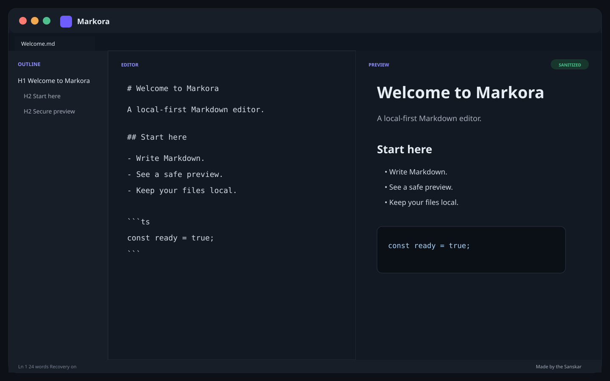

<div align="center">
  

# Markora

**A polished, local-first Markdown workspace for Windows, macOS, and Linux.**

[](https://github.com/sanskarIN/markora/actions/workflows/ci.yml)
[](https://github.com/sanskarIN/markora/actions/workflows/codeql.yml)
[](LICENSE)
[](https://buymeacoffee.com/sanskarIN)

**Made by the Sanskar**

</div>



> The image above is editable project artwork that represents the implemented layout. It is intentionally not presented as a packaged-release screenshot. Replace it with privacy-safe screenshots from verified release builds before the stable launch.

## Why Markora?

Markora is designed for people who want a serious Markdown editor without creating an account or sending their writing to a service by default. It combines a fast React/TypeScript editing experience with a Rust/Tauri shell, validated native file operations, automatic local recovery, a sanitized GitHub-Flavored Markdown preview, and a keyboard-first workflow.

The application intentionally treats document contents as sensitive: raw Markdown is not intentionally logged, remote preview images are blocked, unsafe link schemes are rejected, and native access is exposed through platform-scoped least-privilege Tauri capabilities instead of a broad webview permission surface.

## Features

- **Markdown editor + live preview** with CommonMark/GFM behavior.
- **Safe rendering pipeline** using `react-markdown`, `remark-gfm`, `rehype-sanitize`, heading slugs, and fenced-code syntax highlighting.
- **Privacy-oriented preview** that blocks raw HTML execution, unsafe URL schemes, and remote image requests by default.
- **Multiple document tabs** with dirty-state indicators and recent-file reopening.
- **Outline navigation + breadcrumbs** derived from ATX headings while ignoring fenced code blocks.
- **Find and replace** with case/whole-word matching, bounded regex mode, next/previous navigation, single replace, replace-all, and local find history.
- **Document statistics** for words, characters, lines, paragraphs, headings, links, lists/tasks, code blocks, and reading time.
- **Autosave for path-backed desktop files** plus versioned local recovery snapshots for all active tabs.
- **External-change protection** using desktop file fingerprints, guarded saves, and explicit disk reload.
- **Workspace backup and restore** with validated versioned JSON envelopes.
- **HTML export** through the same sanitized renderer used by the preview.
- **Print/PDF workflow** with page-size, margin, metadata, heading-break, code-wrap, and export-template preferences.
- **Command palette and configurable keyboard shortcuts** with duplicate-binding rejection and reset-to-default behavior.
- **Light, dark, and system appearance**, plus Graphite, Aurora, and Paper editor themes.
- **Local/system writing-font presets** without remote font downloads.
- **Split/editor/preview layouts**, persisted pane ratio, session presets, and distraction-free writing.
- **English and Hindi interface packs** with local language persistence and locale-aware HTML export.
- **Accessibility hardening** including semantic controls, keyboard access, focus visibility, reduced motion, forced-colors support, and bidi/complex-script fixtures.
- **Validated drag-and-drop and native/mobile document-picker flows**.
- **Local-first onboarding, settings, privacy, accessibility, update, recovery, and About experiences**.
- **Cross-platform desktop packaging** for Windows, macOS, and Linux through Tauri.
- **Android project target** with picker-scoped file access and its own CI/manual release checklist.

## Supported platforms

Stable desktop compatibility targets are defined in [docs/support-policy.md](docs/support-policy.md).

| Platform | Project target | Notes |
| --- | --- | --- |
| Windows | Stable desktop target | WebView2-based Tauri desktop app |
| macOS | Stable desktop target | Platform WebKit-based Tauri desktop app |
| Linux | Stable desktop target | Requires a WebKitGTK 4.1-compatible runtime |
| Android | Separate mobile target | Tauri mobile shell with picker-scoped file access; production release verification is tracked separately |
| Browser | Development/test surface | Native disk/recent-file behavior has safe fallbacks or is unavailable |

A target is considered release-verified only after the relevant packaged artifact has been installed, launched, smoke-tested, and removed successfully. CI compilation alone is not runtime verification.

## Technology stack

- **Desktop/mobile shell:** Rust + Tauri 2
- **Frontend:** React 19 + TypeScript + Vite
- **Markdown:** `react-markdown`, `remark-gfm`, `rehype-sanitize`, `rehype-slug`, `rehype-highlight`
- **Desktop dialogs:** `rfd`
- **Mobile picker/files:** Tauri dialog/filesystem/persisted-scope plugins
- **Atomic desktop file replacement:** `tempfile`
- **Testing:** Vitest, Testing Library, Playwright, Rust unit tests
- **Quality/security:** ESLint, Prettier, capability/version/bundle audits, Clippy, rustfmt, CodeQL, cargo-audit, npm audit, Gitleaks
- **Automation:** GitHub Actions + Dependabot

## Quick start

### Requirements

Install:

- Node.js **22.12+** and npm **10+**
- Rust stable **1.85+** with Cargo
- Tauri platform prerequisites for your operating system

See [docs/setup.md](docs/setup.md) for platform-specific prerequisites.

### Development browser preview

```bash
git clone https://github.com/sanskarIN/markora.git
cd markora
npm install
npm run dev
```

Open `http://127.0.0.1:1420` if it does not open automatically.

### Desktop development

Generate platform icons once after a clean clone, then run Tauri:

```bash
npm install
npm run icons
npm run tauri:dev
```

## Full development setup

- [Setup](docs/setup.md)
- [Development workflow](docs/development.md)
- [Testing and quality](docs/testing.md)
- [Troubleshooting](docs/troubleshooting.md)
- [Android](docs/android.md)

No `.env` secrets are needed for normal local editing. `.env.example` contains placeholder configuration names only.

## Testing and quality checks

Run the normal repository gate:

```bash
npm run quality
```

It checks synchronized versions, Tauri capability boundaries, formatting, lint, types, unit/component tests, production build, and the frontend bundle-size budget.

Run end-to-end browser journeys and performance/accessibility/recovery fixtures:

```bash
npx playwright install chromium
npm run test:e2e
```

Run Rust checks:

```bash
cargo fmt --manifest-path src-tauri/Cargo.toml --all -- --check
cargo clippy --manifest-path src-tauri/Cargo.toml --all-targets --all-features -- -D warnings
cargo test --manifest-path src-tauri/Cargo.toml --all-features
```

The CI workflow repeats repository/Rust checks and attempts desktop bundle builds on Ubuntu, macOS, and Windows. See [docs/testing.md](docs/testing.md).

## Build and release

Generate icons and create a local desktop release bundle:

```bash
npm install
npm run icons
npm run tauri:build
```

Tagged versions matching `v*` trigger cross-platform packaging into a **draft GitHub Release**. The release workflow rejects version/tag drift and audits the Tauri capability boundary before packaging.

Release documentation:

- [Release process](docs/release.md)
- [Install/uninstall verification](docs/install-uninstall.md)
- [Compatibility/support policy](docs/support-policy.md)
- [Signing/notarization strategy](docs/signing.md)

## Architecture overview

Markora is a modular desktop/mobile monolith:

```text
React UI
  ├─ components/          presentation and interaction
  ├─ hooks/               workspace orchestration
  ├─ lib/document.ts      Markdown/editor domain utilities
  ├─ lib/markdown.tsx     sanitized rendering/export
  ├─ lib/storage.ts       versioned recovery/backup
  ├─ lib/security.ts      URL and logging safety helpers
  └─ lib/platform.ts      desktop/mobile/web adapter boundary
            │
            │ Tauri invoke / scoped plugins
            ▼
Rust + Tauri authority
  ├─ explicit AppManifest command allow-list
  ├─ desktop validated file/export/link commands
  └─ mobile picker/filesystem/opener scopes
```

Desktop and mobile capabilities are platform-scoped. The frontend receives only event listen/unlisten plus the explicit Markora command/plugin permissions needed for that platform; broad `core:default` and frontend event emit permissions are intentionally absent. See [docs/architecture.md](docs/architecture.md), [docs/security-review-2026-08.md](docs/security-review-2026-08.md), and [docs/adr/](docs/adr/).

## Security

Security-sensitive defaults include:

- restrictive Content Security Policy for both Tauri and browser-development entry points;
- raw HTML is not interpreted as executable preview HTML;
- `javascript:`, `data:`, `file:`, and other unapproved link schemes are blocked;
- external links are limited to HTTP, HTTPS, and mailto;
- remote Markdown images are represented as text instead of fetched automatically;
- Markdown reads and writes are bounded by safety limits;
- native reads reject symbolic links and non-regular files;
- saves/exports use temporary-file replacement where supported by the native implementation;
- logs redact paths, content-like keys, credentials, and secret-like fields;
- unknown native failures are not directly leaked to user-facing toasts;
- custom Tauri commands require explicit app permissions and platform-scoped capabilities;
- CI runs capability regression checks, CodeQL, dependency audits, and history secret scanning.

Report vulnerabilities privately using [SECURITY.md](SECURITY.md). Do **not** post exploit details or private documents in a public issue.

## Privacy and data storage

Markora requires no account for local editing and contains no intentional analytics pipeline. Workspace recovery data is stored locally in application webview storage. Path-backed desktop files remain on disk at locations you choose; mobile files are selected through the platform picker/scoped filesystem path. Backup/export files are only created when requested.

The preview does not automatically load remote Markdown images. External links open only after an explicit click and scheme validation.

See [PRIVACY.md](PRIVACY.md) for the complete data-flow description.

## Accessibility

The interface is designed around keyboard-reachable native controls, persistent focus indicators, semantic dialogs/tabs/navigation, readable contrast, reduced-motion settings, forced-colors handling, and status text that does not rely only on color. Mixed Hindi/Arabic/Hebrew/emoji fixtures exercise complex-script rendering. Manual packaged-build screen-reader verification remains a release gate. See [docs/accessibility.md](docs/accessibility.md).

## Performance

The editor uses local computation and avoids network work in the editing path. Conservative automated startup, medium-preview, large-outline, and production-bundle budgets are tracked in [docs/performance.md](docs/performance.md). Native packaged startup/package size remains part of release-candidate measurement.

## Contributing

Contributions are welcome. Please read:

1. [CONTRIBUTING.md](CONTRIBUTING.md)
2. [CODE_OF_CONDUCT.md](CODE_OF_CONDUCT.md)
3. [SECURITY.md](SECURITY.md)
4. [docs/development.md](docs/development.md)
5. [docs/testing.md](docs/testing.md)

Small, atomic commits using Conventional Commit-style messages are preferred. Every behavior change should include the smallest practical verification or regression coverage.

## Project status and roadmap

- Current development version: **0.5.0**
- Current milestone: **stable-release candidate hardening; v1.0 manual/package gates remain open**
- Changelog: [CHANGELOG.md](CHANGELOG.md)
- Roadmap: [ROADMAP.md](ROADMAP.md)
- Session/development handoff: [what_changed.md](what_changed.md)

`what_changed.md` is intentionally maintained as a precise continuation record for coding sessions and should not be treated as marketing copy.

## License

Markora is open source under the [MIT License](LICENSE).

Copyright © 2026 Sanskar.

## Support and contact

- GitHub: [https://github.com/sanskarIN](https://github.com/sanskarIN)
- Repository: [https://github.com/sanskarIN/markora](https://github.com/sanskarIN/markora)
- Business: [sanskarin@outlook.in](mailto:sanskarin@outlook.in)
- Business: [sanskarin.business@gmail.com](mailto:sanskarin.business@gmail.com)
- Support: [supportramsandesh@gmail.com](mailto:supportramsandesh@gmail.com)
- Buy Me a Coffee: [https://buymeacoffee.com/sanskarIN](https://buymeacoffee.com/sanskarIN)

[](https://buymeacoffee.com/sanskarIN)

Funding is optional. Markora's editing features are not gated behind donations.

---

<div align="center"><strong>Made by the Sanskar</strong></div>
